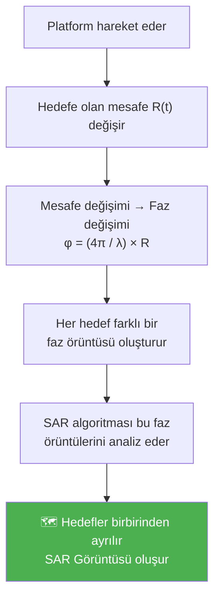
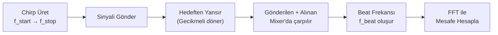
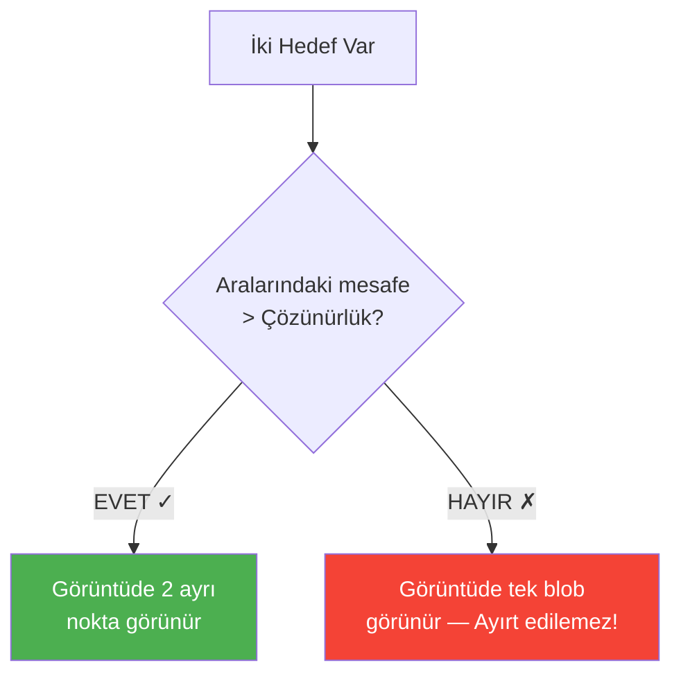
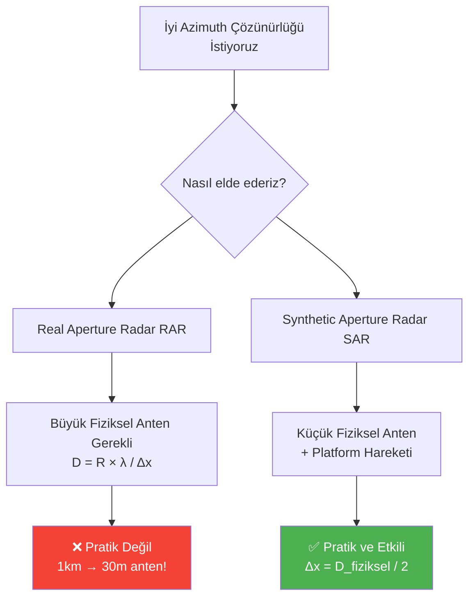
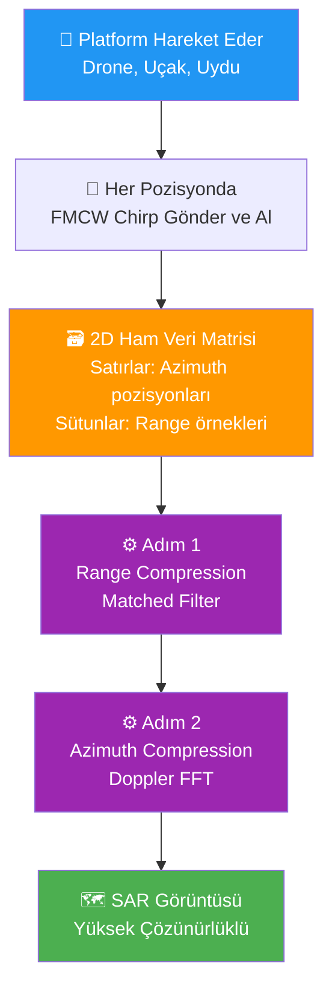
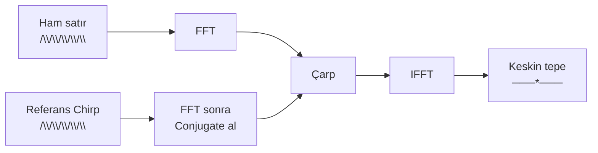
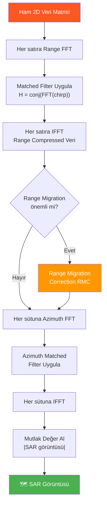
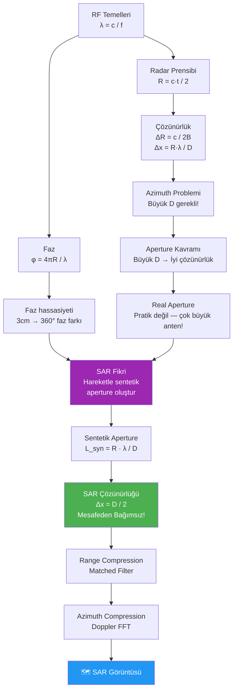

# 📡 SAR (Sentetik Açıklıklı Radar) Öğrenme Rehberi

> **💡 VS Code Extensions:**
> - **Matematik formülleri** için: `Markdown Preview Enhanced` → Ctrl+Shift+P → "Markdown Preview Enhanced: Open Preview"
> - **Mermaid flowchartlar** bu extension içinde zaten destekleniyor.

---

## İçindekiler

1. [RF Temelleri](#1-rf-temelleri)
2. [Radar Prensibi](#2-radar-prensibi)
3. [Faz Nedir?](#3-faz-nedir)
4. [FMCW Radar](#4-fmcw-radar)
5. [Çözünürlük Kavramları](#5-çözünürlük-kavramları)
6. [Aperture (Açıklık) Nedir?](#6-aperture-açıklık-nedir)
7. [SAR Prensibi](#7-sar-prensibi)
8. [SAR Sinyal İşleme Akışı](#8-sar-sinyal-işleme-akışı)
9. [Formül Referans Kartı](#9-formül-referans-kartı)

---

## 1. RF Temelleri

### Elektromanyetik Dalga

Radar, elektromanyetik dalgalar göndererek ve yansımalarını alarak çalışır. Her dalganın iki temel parametresi vardır: **frekans** ve **dalga boyu**.

$$c = f \times \lambda$$

| Sembol | Anlam | Birim |
|--------|-------|-------|
| $c$ | Işık hızı $\approx 3 \times 10^8$ | m/s |
| $f$ | Frekans | Hz |
| $\lambda$ | Dalga boyu | m |

**Örnek:** $f = 10$ GHz için dalga boyu:

$$\lambda = \frac{c}{f} = \frac{3 \times 10^8}{10 \times 10^9} = 0.03 \text{ m} = 3 \text{ cm}$$

### Neden Frekans Önemli?

```
Düşük frekans  → Uzun dalga boyu  → Atmosfer geçişi ✓  | Çözünürlük kötü ✗
Yüksek frekans → Kısa dalga boyu  → Atmosfer zayıflar ✗ | Çözünürlük iyi ✓
```

### Radar Frekans Bantları

| Bant | Frekans Aralığı | Dalga Boyu | Örnek Kullanım |
|------|----------------|------------|----------------|
| L-Band | 1–2 GHz | 15–30 cm | Uzak menzilli SAR |
| C-Band | 4–8 GHz | 3.75–7.5 cm | Sentinel-1 (ESA) |
| X-Band | 8–12 GHz | 2.5–3.75 cm | Askeri SAR |
| K-Band | 18–27 GHz | 1.1–1.67 cm | Kısa menzilli SAR |

---

## 2. Radar Prensibi

### Temel Çalışma Mantığı


### Mesafe Hesabı

Sinyal gönderilir, hedeften yansır ve geri döner. Toplam yol $2R$ olduğu için 2'ye bölünür:

$$R = \frac{c \times t}{2}$$

| Sembol | Anlam |
|--------|-------|
| $R$ | Mesafe (m) |
| $t$ | Gidiş-dönüş süresi (s) |

**Örnek:** $t = 1\ \mu s$ ise:

$$R = \frac{3 \times 10^8 \times 1 \times 10^{-6}}{2} = 150 \text{ m}$$

---

## 3. Faz Nedir?

### Temel Tanım

Sinüs dalgası şu şekilde ifade edilir:

$$s(t) = A \cdot \sin(2\pi f t + \varphi)$$

Burada $\varphi$ **fazdır**. Faz, "dalganın döngü içindeki hangi noktasında olduğumuzu" gösterir.

```
Faz:    0°        90°       180°      270°      360°
         |         |          |         |         |
    1  - *                    *                   *
         | *               *  | *               * |
    0  - |    *         *     |    *         *    |
         |       *   *        |       *   *       |
   -1  - |          *         |          *        |
```

### Radarda Faz

Radar sinyali hedefe gidip gelirken gecikir. Bu gecikme doğrudan faz kaymasına dönüşür:

$$\varphi = \frac{4\pi}{\lambda} \times R$$

| $\lambda$ | $R$ değişimi | Faz değişimi |
|-----------|-------------|--------------|
| 3 cm | 1.5 cm | 180° (yarım tur) |
| 3 cm | 3 cm | 360° (tam tur) |

> **Kritik nokta:** Sadece 3 cm'lik mesafe değişimi tam bir tur faz değişimine yol açar. SAR bu inanılmaz hassasiyeti kullanır!

### Faz Neden SAR İçin Kritiktir?



---

## 4. FMCW Radar

### FMCW Nedir?

**F**requency **M**odulated **C**ontinuous **W**ave — Frekansı sürekli doğrusal olarak değişen (chirp) sinyal gönderen radar türüdür.



### Chirp Sinyali

```
Frekans
  ↑
f_stop ─ ─ ─ ─ /          / ← Gönderilen
               /          /
              /     ← Alınan (gecikmeli)
             /      /
f_start ────/──────/────────→ Zaman
            |←T_chirp→|
            |←τ→| (gecikme)
```

Beat frekansı, gönderilen ve alınan sinyalin frekans farkıdır:

$$f_{beat} = \frac{B}{T_{chirp}} \times \frac{2R}{c}$$

Buradan mesafe:

$$R = \frac{f_{beat} \times c \times T_{chirp}}{2B}$$

| Sembol | Anlam |
|--------|-------|
| $B$ | Bant genişliği (Hz) |
| $T_{chirp}$ | Chirp süresi (s) |
| $f_{beat}$ | Beat frekansı (Hz) |

### Neden FMCW Tercih Edilir?

| Özellik | FMCW | Pulse Radar |
|---------|------|-------------|
| Güç tüketimi | Düşük ✓ | Yüksek ✗ |
| Donanım karmaşıklığı | Basit ✓ | Karmaşık ✗ |
| SAR uyumluluğu | İdeal ✓ | Zor ✗ |
| Kör mesafe (blind range) | Yok ✓ | Var ✗ |

---

## 5. Çözünürlük Kavramları

### Radar Görüntüsü Nedir?

Radar, tıpkı kamera gibi 2 boyutlu görüntü oluşturur. Farkı: ışık yerine radyo dalgası kullanır.

```
        Azimuth (Cross-range) →
    ┌────────────────────────────┐
    │                            │  ↑
    │   [🚗]        [🚗]         │  Range
    │                            │  (Mesafe)
    │         [🏠]               │  ↓
    └────────────────────────────┘

Eğer iki araç arasındaki mesafe < çözünürlük ise
→ Görüntüde tek bir nokta (blob) görünür!
```

### İki Tür Çözünürlük

#### A) Range (Mesafe) Çözünürlüğü

İki nesneyi **derinlik** yönünde ayırt etme yeteneği. Bant genişliğine bağlıdır:

$$\Delta R = \frac{c}{2B}$$

**Örnek:** $B = 100$ MHz için:

$$\Delta R = \frac{3 \times 10^8}{2 \times 100 \times 10^6} = 1.5 \text{ m}$$

> ✅ Bant genişliği artırılabilir → Range çözünürlüğü iyileştirilebilir.

#### B) Azimuth (Cross-range) Çözünürlüğü

İki nesneyi **yan yana** yönde ayırt etme yeteneği. Anten boyutuna bağlıdır:

$$\Delta x = R \times \frac{\lambda}{D}$$

| Sembol | Anlam |
|--------|-------|
| $R$ | Hedefe olan mesafe (m) |
| $D$ | Fiziksel anten boyutu (m) |

**Örnek:** $R = 1000$ m, $\lambda = 3$ cm, $D = 0.1$ m için:

$$\Delta x = 1000 \times \frac{0.03}{0.1} = 300 \text{ m}$$

> ⚠️ 1 km mesafede 300 metre çözünürlük — yan yana iki araba kesinlikle ayırt edilemez!

### Çözünürlük ve Görüntü İlişkisi



---

## 6. Aperture (Açıklık) Nedir?

### Fiziksel Tanım

Aperture, elektromanyetik dalgaları toplayan veya yayan **fiziksel boyuttur**.

```
Göz      → Göz bebeği çapı          = aperture
Teleskop → Lens/ayna çapı           = aperture
Radar    → Fiziksel anten boyutu    = aperture
```

Değiştirilemez bir fizik yasası olan **difraksiyon limiti**:

$$\theta_{min} = \frac{\lambda}{D}$$

Bu limit ışık, ses, radar — tüm dalgalar için geçerlidir.

### Aperture Büyüklüğü ve Işın Genişliği

```
Küçük Aperture (D küçük):      Büyük Aperture (D büyük):

       ↓ Radar                         ↓ Radar
      /────\                           /──\
     /      \    Geniş ışın           /    \   Dar ışın
    /        \                        /      \
   /          \                      /        \
                                    
  Kötü çözünürlük ✗               İyi çözünürlük ✓
```

### Gereken Fiziksel Aperture

1 metre çözünürlük elde etmek için gereken anten boyutu ($\lambda = 3$ cm):

$$D_{gerekli} = \frac{R \times \lambda}{\Delta x_{hedef}}$$

| Mesafe | Hesap | Gereken Anten |
|--------|-------|---------------|
| 100 m | $\frac{100 \times 0.03}{1}$ | **3 m** |
| 1 km | $\frac{1000 \times 0.03}{1}$ | **30 m** |
| 10 km | $\frac{10000 \times 0.03}{1}$ | **300 m** |
| 500 km (uydu) | $\frac{500000 \times 0.03}{1}$ | **15.000 m** 🚨 |

> 🚨 Uydu için 15 km'lik anten — fiziksel olarak imkansız! **SAR bu sorunu çözer.**

### Real Aperture vs Synthetic Aperture



---

## 7. SAR Prensibi

### Sentetik Aperture Nasıl Oluşur?

Platform hareket ederken her pozisyondan radar pulsları gönderir. Bu sinyaller **doğru fazla birleştirilince** sanki çok büyük bir antenmiş gibi davranılır:

```
Platform hareketi →
●─────●─────●─────●─────●─────●─────●
t1    t2    t3    t4    t5    t6    t7

Her ● = Küçük fiziksel anten (D_fiziksel)

│←─────────── Sentetik Aperture (L_syn) ──────────────→│
              (Sanal çok büyük anten)
```

### SAR Geometrisi

```
        Platform hareketi (hız = v)
  ●─────────────────────────────────────→
  |           |           |
  |           | R0        |
  | R(t1)     |           | R(t3)
   \          |          /
    \         |         /
     \        |        /
      \       |       /
       \      |      /
        \     ↓     /
         [  Hedef  ]

R(t):  Anlık mesafe — hiperbolik değişir
R0:    En yakın mesafe (minimum)
```

### Anlık Mesafe — Hiperbolik Değişim

Platform hareket ederken hedefin mesafesi zamanla hiperbolik olarak değişir:

$$R(t) = \sqrt{R_0^2 + v^2 t^2}$$

Küçük açılar için ikinci dereceden yaklaşım:

$$R(t) \approx R_0 + \frac{v^2 t^2}{2R_0}$$

Bu hiperbolik değişim, ham SAR verisinde karakteristik kavisli izler oluşturur.

### Sentetik Aperture Uzunluğu

Hedef, anten ışın genişliği içinde kaldığı sürede platform bu kadar yol kat eder:

$$L_{syn} = R_0 \times \frac{\lambda}{D_{fiziksel}}$$

**Örnek:** $R_0 = 1000$ m, $\lambda = 3$ cm, $D = 0.1$ m için:

$$L_{syn} = 1000 \times \frac{0.03}{0.1} = 300 \text{ m}$$

Yani platform 300 metre boyunca sinyal toplar ve bunları birleştirir!

### SAR Çözünürlüğü — Sürpriz Sonuç

$$\boxed{\Delta x_{SAR} = \frac{D_{fiziksel}}{2}}$$

**Bu formülde $R$ (mesafe) yok!** SAR çözünürlüğü mesafeden tamamen bağımsızdır.

| Özellik | Real Aperture Radar | SAR |
|---------|--------------------|----|
| Azimuth çözünürlüğü | $\Delta x = R \cdot \lambda / D$ | $\Delta x = D / 2$ |
| Mesafe arttıkça | ✗ Çözünürlük bozulur | ✓ Değişmez |
| Küçük anten | ✗ Kötü çözünürlük | ✓ Uzun $L_{syn}$ → Daha fazla veri |

> 🎯 **Paradoks:** SAR'da daha küçük fiziksel anten, daha uzun sentetik aperture demektir. Sonuç yine $D/2$.

### Doppler Etkisi ve SAR

Platform hareket ederken hedefin görüş açısı sürekli değişir. Bu da Doppler frekansı oluşturur:

$$f_d = \frac{2v \cdot \sin(\theta)}{\lambda}$$

```
Platform:  ←────────────[●]────────────→
                          ↓
           Yaklaşıyor     |     Uzaklaşıyor
           +f_doppler     |     -f_doppler
           (Mavi kayma)   |     (Kırmızı kayma)
                        [Hedef]
```

Her hedefin azimuth pozisyonu farklı Doppler örüntüsü üretir. FFT ile bu örüntüler ayrıştırılır ve azimuth çözünürlüğü elde edilir.

---

## 8. SAR Sinyal İşleme Akışı

### Genel Akış



### Ham Veri Matrisi

```
        Range (hızlı zaman) →
        ├──────────────────────────┤
    t1  │ ■ ■ ■ ■ ■ ■ ■ ■ ■ ■ ■ │  ↑
    t2  │ ■ ■ ■ ■ ■ ■ ■ ■ ■ ■ ■ │  Azimuth
    t3  │ ■ ■ ■ ■ ■ ■ ■ ■ ■ ■ ■ │  (yavaş zaman)
    t4  │ ■ ■ ■ ■ ■ ■ ■ ■ ■ ■ ■ │  Platform
    t5  │ ■ ■ ■ ■ ■ ■ ■ ■ ■ ■ ■ │  hareketi
    ..  │ ■ ■ ■ ■ ■ ■ ■ ■ ■ ■ ■ │  ↓
    tN  │ ■ ■ ■ ■ ■ ■ ■ ■ ■ ■ ■ │
        └──────────────────────────┘
     Henüz görüntü değil — ham karmaşık sayılar!
```

### Adım 1: Range Compression (Mesafe Sıkıştırma)

Her azimuth satırına matched filter uygulanır. Bu aslında bir **korelasyon** işlemidir:

$$s_{range}(t) = \text{IFFT}\Bigl[\text{FFT}(s_{alınan}) \times \text{FFT}^*(s_{chirp})\Bigr]$$



Alınan sinyali referans chirp ile karşılaştırıyoruz. Chirp sinyali sıkışır ve mesafe yönünde keskin bir nokta oluşur.

### Adım 2: Azimuth Compression (Açısal Sıkıştırma)

Range compression sonrası her hedefin izi azimuth yönünde hiperbolik bir kavis çizer:

```
Azimuth pozisyonu →
─────────────────────────────────────────
           *              ← Hedefin hiperbolik izi
         *   *
       *       *
     *           *
─────────────────────────────────────────
```

Bu hiperbolik iz Doppler işleme (azimuth FFT) ile düzeltilir ve sıkıştırılır:

$$s_{SAR} = \text{IFFT}_{azimuth}\Bigl[s_{range\_compressed}\Bigr]$$

### Range-Doppler Algoritması — Tam Akış



---

## Özet: Tüm Kavramların Bağlantısı



---

## 9. Formül Referans Kartı

| Kavram | Formül | Açıklama |
|--------|--------|----------|
| Dalga boyu | $\lambda = c / f$ | Frekans ↑ → Dalga boyu ↓ |
| Mesafe | $R = c \cdot t / 2$ | Gidiş-dönüş süresinden |
| Faz | $\varphi = \dfrac{4\pi R}{\lambda}$ | Mesafe → Faz dönüşümü |
| Range çözünürlüğü | $\Delta R = c / 2B$ | Bant genişliği ↑ → Çözünürlük ↑ |
| RAR Azimuth çözünürlüğü | $\Delta x = R \cdot \lambda / D$ | Mesafe ↑ → Kötüleşir |
| Beat frekansı | $f_{beat} = \dfrac{B}{T} \cdot \dfrac{2R}{c}$ | FMCW mesafe ölçümü |
| Sentetik aperture | $L_{syn} = R \cdot \lambda / D$ | Uzun = Daha fazla veri |
| **SAR çözünürlüğü** | $\Delta x_{SAR} = D / 2$ | **Mesafeden bağımsız!** |
| Doppler frekansı | $f_d = 2v \sin(\theta) / \lambda$ | Azimuth işleme temeli |
| Anlık mesafe | $R(t) = \sqrt{R_0^2 + v^2 t^2}$ | Hiperbolik değişim |

---

*Sıradaki adım: Matched filter detayları, Range Migration Correction ve gerçek SAR verisi üzerinde uygulama.*