# 📡 SAR (Sentetik Açıklıklı Radar) Öğrenme Rehberi

> **💡 VS Code Extensions:**
> - **Matematik formülleri** için: `Markdown Preview Enhanced` → Ctrl+Shift+P → "Markdown Preview Enhanced: Open Preview"
> - **Mermaid flowchartlar** bu extension içinde zaten destekleniyor.

---

## İçindekiler

1. [RF Temelleri](#1-rf-temelleri)
2. [Radar Prensibi](#2-radar-prensibi)
3. [Faz Nedir?](#3-faz-nedir)
4. [FMCW Radar](#4-fmcw-radar)
5. [Çözünürlük Kavramları](#5-çözünürlük-kavramları)
6. [Aperture (Açıklık) Nedir?](#6-aperture-açıklık-nedir)
7. [SAR Prensibi](#7-sar-prensibi)
8. [SAR Sinyal İşleme Akışı](#8-sar-sinyal-işleme-akışı)
9. [Formül Referans Kartı](#9-formül-referans-kartı)

---

## 1. RF Temelleri

### Elektromanyetik Dalga

Radar, elektromanyetik dalgalar göndererek ve yansımalarını alarak çalışır. Her dalganın iki temel parametresi vardır: **frekans** ve **dalga boyu**.

$$c = f \times \lambda$$

| Sembol | Anlam | Birim |
|--------|-------|-------|
| $c$ | Işık hızı $\approx 3 \times 10^8$ | m/s |
| $f$ | Frekans | Hz |
| $\lambda$ | Dalga boyu | m |

**Örnek:** $f = 10$ GHz için dalga boyu:

$$\lambda = \frac{c}{f} = \frac{3 \times 10^8}{10 \times 10^9} = 0.03 \text{ m} = 3 \text{ cm}$$

### Neden Frekans Önemli?

```
Düşük frekans  → Uzun dalga boyu  → Atmosfer geçişi ✓  | Çözünürlük kötü ✗
Yüksek frekans → Kısa dalga boyu  → Atmosfer zayıflar ✗ | Çözünürlük iyi ✓
```

### Radar Frekans Bantları

| Bant | Frekans Aralığı | Dalga Boyu | Örnek Kullanım |
|------|----------------|------------|----------------|
| L-Band | 1–2 GHz | 15–30 cm | Uzak menzilli SAR |
| C-Band | 4–8 GHz | 3.75–7.5 cm | Sentinel-1 (ESA) |
| X-Band | 8–12 GHz | 2.5–3.75 cm | Askeri SAR |
| K-Band | 18–27 GHz | 1.1–1.67 cm | Kısa menzilli SAR |

---

## 2. Radar Prensibi

### Temel Çalışma Mantığı

```mermaid
flowchart LR
    A["🔴 Sinyal Gönder\n(Chirp)"] --> B["🎯 Hedeften\nYansır"]
    B --> C["📡 Sinyali Al\n(Gecikmeli)"]
    C --> D["⏱️ Gidiş-Dönüş\nSüresini Ölç"]
    D --> E["📏 Mesafeyi\nHesapla"]
```

### Mesafe Hesabı

Sinyal gönderilir, hedeften yansır ve geri döner. Toplam yol $2R$ olduğu için 2'ye bölünür:

$$R = \frac{c \times t}{2}$$

| Sembol | Anlam |
|--------|-------|
| $R$ | Mesafe (m) |
| $t$ | Gidiş-dönüş süresi (s) |

**Örnek:** $t = 1\ \mu s$ ise:

$$R = \frac{3 \times 10^8 \times 1 \times 10^{-6}}{2} = 150 \text{ m}$$

---

## 3. Faz Nedir?

### Temel Tanım

Sinüs dalgası şu şekilde ifade edilir:

$$s(t) = A \cdot \sin(2\pi f t + \varphi)$$

Burada $\varphi$ **fazdır**. Faz, "dalganın döngü içindeki hangi noktasında olduğumuzu" gösterir.

```
Faz:    0°        90°       180°      270°      360°
         |         |          |         |         |
    1  - *                    *                   *
         | *               *  | *               * |
    0  - |    *         *     |    *         *    |
         |       *   *        |       *   *       |
   -1  - |          *         |          *        |
```

### Radarda Faz

Radar sinyali hedefe gidip gelirken gecikir. Bu gecikme doğrudan faz kaymasına dönüşür:

$$\varphi = \frac{4\pi}{\lambda} \times R$$

| $\lambda$ | $R$ değişimi | Faz değişimi |
|-----------|-------------|--------------|
| 3 cm | 1.5 cm | 180° (yarım tur) |
| 3 cm | 3 cm | 360° (tam tur) |

> **Kritik nokta:** Sadece 3 cm'lik mesafe değişimi tam bir tur faz değişimine yol açar. SAR bu inanılmaz hassasiyeti kullanır!

### Faz Neden SAR İçin Kritiktir?

```mermaid
flowchart TD
    A["Platform hareket eder"] --> B["Hedefe olan mesafe R(t) değişir"]
    B --> C["Mesafe değişimi → Faz değişimi\nφ = (4π / λ) × R"]
    C --> D["Her hedef farklı bir\nfaz örüntüsü oluşturur"]
    D --> E["SAR algoritması bu faz\nörüntülerini analiz eder"]
    E --> F["🗺️ Hedefler birbirinden ayrılır\nSAR Görüntüsü oluşur"]

    style F fill:#4CAF50,color:#fff
```

---

## 4. FMCW Radar

### FMCW Nedir?

**F**requency **M**odulated **C**ontinuous **W**ave — Frekansı sürekli doğrusal olarak değişen (chirp) sinyal gönderen radar türüdür.

```mermaid
flowchart LR
    A["Chirp Üret\nf_start → f_stop"] --> B["Sinyali Gönder"]
    B --> C["Hedeften Yansır\n(Gecikmeli döner)"]
    C --> D["Gönderilen + Alınan\nMixer'da çarpılır"]
    D --> E["Beat Frekansı\nf_beat oluşur"]
    E --> F["FFT ile\nMesafe Hesapla"]
```

### Chirp Sinyali

```
Frekans
  ↑
f_stop ─ ─ ─ ─ /          / ← Gönderilen
               /          /
              /     ← Alınan (gecikmeli)
             /      /
f_start ────/──────/────────→ Zaman
            |←T_chirp→|
            |←τ→| (gecikme)
```

Beat frekansı, gönderilen ve alınan sinyalin frekans farkıdır:

$$f_{beat} = \frac{B}{T_{chirp}} \times \frac{2R}{c}$$

Buradan mesafe:

$$R = \frac{f_{beat} \times c \times T_{chirp}}{2B}$$

| Sembol | Anlam |
|--------|-------|
| $B$ | Bant genişliği (Hz) |
| $T_{chirp}$ | Chirp süresi (s) |
| $f_{beat}$ | Beat frekansı (Hz) |

### Neden FMCW Tercih Edilir?

| Özellik | FMCW | Pulse Radar |
|---------|------|-------------|
| Güç tüketimi | Düşük ✓ | Yüksek ✗ |
| Donanım karmaşıklığı | Basit ✓ | Karmaşık ✗ |
| SAR uyumluluğu | İdeal ✓ | Zor ✗ |
| Kör mesafe (blind range) | Yok ✓ | Var ✗ |

---

## 5. Çözünürlük Kavramları

### Radar Görüntüsü Nedir?

Radar, tıpkı kamera gibi 2 boyutlu görüntü oluşturur. Farkı: ışık yerine radyo dalgası kullanır.

```
        Azimuth (Cross-range) →
    ┌────────────────────────────┐
    │                            │  ↑
    │   [🚗]        [🚗]         │  Range
    │                            │  (Mesafe)
    │         [🏠]               │  ↓
    └────────────────────────────┘

Eğer iki araç arasındaki mesafe < çözünürlük ise
→ Görüntüde tek bir nokta (blob) görünür!
```

### İki Tür Çözünürlük

#### A) Range (Mesafe) Çözünürlüğü

İki nesneyi **derinlik** yönünde ayırt etme yeteneği. Bant genişliğine bağlıdır:

$$\Delta R = \frac{c}{2B}$$

**Örnek:** $B = 100$ MHz için:

$$\Delta R = \frac{3 \times 10^8}{2 \times 100 \times 10^6} = 1.5 \text{ m}$$

> ✅ Bant genişliği artırılabilir → Range çözünürlüğü iyileştirilebilir.

#### B) Azimuth (Cross-range) Çözünürlüğü

İki nesneyi **yan yana** yönde ayırt etme yeteneği. Anten boyutuna bağlıdır:

$$\Delta x = R \times \frac{\lambda}{D}$$

| Sembol | Anlam |
|--------|-------|
| $R$ | Hedefe olan mesafe (m) |
| $D$ | Fiziksel anten boyutu (m) |

**Örnek:** $R = 1000$ m, $\lambda = 3$ cm, $D = 0.1$ m için:

$$\Delta x = 1000 \times \frac{0.03}{0.1} = 300 \text{ m}$$

> ⚠️ 1 km mesafede 300 metre çözünürlük — yan yana iki araba kesinlikle ayırt edilemez!

### Çözünürlük ve Görüntü İlişkisi

```mermaid
flowchart TD
    A["İki Hedef Var"] --> B{"Aralarındaki mesafe\n> Çözünürlük?"}
    B -->|"EVET ✓"| C["Görüntüde 2 ayrı\nnokta görünür"]
    B -->|"HAYIR ✗"| D["Görüntüde tek blob\ngörünür — Ayırt edilemez!"]

    style C fill:#4CAF50,color:#fff
    style D fill:#f44336,color:#fff
```

---

## 6. Aperture (Açıklık) Nedir?

### Fiziksel Tanım

Aperture, elektromanyetik dalgaları toplayan veya yayan **fiziksel boyuttur**.

```
Göz      → Göz bebeği çapı          = aperture
Teleskop → Lens/ayna çapı           = aperture
Radar    → Fiziksel anten boyutu    = aperture
```

Değiştirilemez bir fizik yasası olan **difraksiyon limiti**:

$$\theta_{min} = \frac{\lambda}{D}$$

Bu limit ışık, ses, radar — tüm dalgalar için geçerlidir.

### Aperture Büyüklüğü ve Işın Genişliği

```
Küçük Aperture (D küçük):      Büyük Aperture (D büyük):

       ↓ Radar                         ↓ Radar
      /────\                           /──\
     /      \    Geniş ışın           /    \   Dar ışın
    /        \                        /      \
   /          \                      /        \
                                    
  Kötü çözünürlük ✗               İyi çözünürlük ✓
```

### Gereken Fiziksel Aperture

1 metre çözünürlük elde etmek için gereken anten boyutu ($\lambda = 3$ cm):

$$D_{gerekli} = \frac{R \times \lambda}{\Delta x_{hedef}}$$

| Mesafe | Hesap | Gereken Anten |
|--------|-------|---------------|
| 100 m | $\frac{100 \times 0.03}{1}$ | **3 m** |
| 1 km | $\frac{1000 \times 0.03}{1}$ | **30 m** |
| 10 km | $\frac{10000 \times 0.03}{1}$ | **300 m** |
| 500 km (uydu) | $\frac{500000 \times 0.03}{1}$ | **15.000 m** 🚨 |

> 🚨 Uydu için 15 km'lik anten — fiziksel olarak imkansız! **SAR bu sorunu çözer.**

### Real Aperture vs Synthetic Aperture

```mermaid
flowchart TD
    A["İyi Azimuth Çözünürlüğü\nİstiyoruz"] --> B{"Nasıl elde ederiz?"}

    B --> C["Real Aperture Radar RAR"]
    B --> D["Synthetic Aperture Radar SAR"]

    C --> E["Büyük Fiziksel Anten Gerekli\nD = R × λ / Δx"]
    E --> F["❌ Pratik Değil\n1km → 30m anten!"]

    D --> G["Küçük Fiziksel Anten\n+ Platform Hareketi"]
    G --> H["✅ Pratik ve Etkili\nΔx = D_fiziksel / 2"]

    style F fill:#f44336,color:#fff
    style H fill:#4CAF50,color:#fff
```

---

## 7. SAR Prensibi

### Sentetik Aperture Nasıl Oluşur?

Platform hareket ederken her pozisyondan radar pulsları gönderir. Bu sinyaller **doğru fazla birleştirilince** sanki çok büyük bir antenmiş gibi davranılır:

```
Platform hareketi →
●─────●─────●─────●─────●─────●─────●
t1    t2    t3    t4    t5    t6    t7

Her ● = Küçük fiziksel anten (D_fiziksel)

│←─────────── Sentetik Aperture (L_syn) ──────────────→│
              (Sanal çok büyük anten)
```

### SAR Geometrisi

```
        Platform hareketi (hız = v)
  ●─────────────────────────────────────→
  |           |           |
  |           | R0        |
  | R(t1)     |           | R(t3)
   \          |          /
    \         |         /
     \        |        /
      \       |       /
       \      |      /
        \     ↓     /
         [  Hedef  ]

R(t):  Anlık mesafe — hiperbolik değişir
R0:    En yakın mesafe (minimum)
```

### Anlık Mesafe — Hiperbolik Değişim

Platform hareket ederken hedefin mesafesi zamanla hiperbolik olarak değişir:

$$R(t) = \sqrt{R_0^2 + v^2 t^2}$$

Küçük açılar için ikinci dereceden yaklaşım:

$$R(t) \approx R_0 + \frac{v^2 t^2}{2R_0}$$

Bu hiperbolik değişim, ham SAR verisinde karakteristik kavisli izler oluşturur.

### Sentetik Aperture Uzunluğu

Hedef, anten ışın genişliği içinde kaldığı sürede platform bu kadar yol kat eder:

$$L_{syn} = R_0 \times \frac{\lambda}{D_{fiziksel}}$$

**Örnek:** $R_0 = 1000$ m, $\lambda = 3$ cm, $D = 0.1$ m için:

$$L_{syn} = 1000 \times \frac{0.03}{0.1} = 300 \text{ m}$$

Yani platform 300 metre boyunca sinyal toplar ve bunları birleştirir!

### SAR Çözünürlüğü — Sürpriz Sonuç

$$\boxed{\Delta x_{SAR} = \frac{D_{fiziksel}}{2}}$$

**Bu formülde $R$ (mesafe) yok!** SAR çözünürlüğü mesafeden tamamen bağımsızdır.

| Özellik | Real Aperture Radar | SAR |
|---------|--------------------|----|
| Azimuth çözünürlüğü | $\Delta x = R \cdot \lambda / D$ | $\Delta x = D / 2$ |
| Mesafe arttıkça | ✗ Çözünürlük bozulur | ✓ Değişmez |
| Küçük anten | ✗ Kötü çözünürlük | ✓ Uzun $L_{syn}$ → Daha fazla veri |

> 🎯 **Paradoks:** SAR'da daha küçük fiziksel anten, daha uzun sentetik aperture demektir. Sonuç yine $D/2$.

### Doppler Etkisi ve SAR

Platform hareket ederken hedefin görüş açısı sürekli değişir. Bu da Doppler frekansı oluşturur:

$$f_d = \frac{2v \cdot \sin(\theta)}{\lambda}$$

```
Platform:  ←────────────[●]────────────→
                          ↓
           Yaklaşıyor     |     Uzaklaşıyor
           +f_doppler     |     -f_doppler
           (Mavi kayma)   |     (Kırmızı kayma)
                        [Hedef]
```

Her hedefin azimuth pozisyonu farklı Doppler örüntüsü üretir. FFT ile bu örüntüler ayrıştırılır ve azimuth çözünürlüğü elde edilir.

---

## 8. SAR Sinyal İşleme Akışı

### Genel Akış

```mermaid
flowchart TD
    A["📡 Platform Hareket Eder\nDrone, Uçak, Uydu"] --> B
    B["🔴 Her Pozisyonda\nFMCW Chirp Gönder ve Al"] --> C
    C["🗃️ 2D Ham Veri Matrisi\nSatırlar: Azimuth pozisyonları\nSütunlar: Range örnekleri"] --> D
    D["⚙️ Adım 1\nRange Compression\nMatched Filter"] --> E
    E["⚙️ Adım 2\nAzimuth Compression\nDoppler FFT"] --> F
    F["🗺️ SAR Görüntüsü\nYüksek Çözünürlüklü"]

    style A fill:#2196F3,color:#fff
    style C fill:#FF9800,color:#fff
    style D fill:#9C27B0,color:#fff
    style E fill:#9C27B0,color:#fff
    style F fill:#4CAF50,color:#fff
```

### Ham Veri Matrisi

```
        Range (hızlı zaman) →
        ├──────────────────────────┤
    t1  │ ■ ■ ■ ■ ■ ■ ■ ■ ■ ■ ■ │  ↑
    t2  │ ■ ■ ■ ■ ■ ■ ■ ■ ■ ■ ■ │  Azimuth
    t3  │ ■ ■ ■ ■ ■ ■ ■ ■ ■ ■ ■ │  (yavaş zaman)
    t4  │ ■ ■ ■ ■ ■ ■ ■ ■ ■ ■ ■ │  Platform
    t5  │ ■ ■ ■ ■ ■ ■ ■ ■ ■ ■ ■ │  hareketi
    ..  │ ■ ■ ■ ■ ■ ■ ■ ■ ■ ■ ■ │  ↓
    tN  │ ■ ■ ■ ■ ■ ■ ■ ■ ■ ■ ■ │
        └──────────────────────────┘
     Henüz görüntü değil — ham karmaşık sayılar!
```

### Adım 1: Range Compression (Mesafe Sıkıştırma)

Her azimuth satırına matched filter uygulanır. Bu aslında bir **korelasyon** işlemidir:

$$s_{range}(t) = \text{IFFT}\Bigl[\text{FFT}(s_{alınan}) \times \text{FFT}^*(s_{chirp})\Bigr]$$

```mermaid
flowchart LR
    A["Ham satır\n/\\/\\/\\/\\/\\"] --> B["FFT"]
    C["Referans Chirp\n/\\/\\/\\/\\/\\"] --> D["FFT sonra\nConjugate al"]
    B --> E["Çarp"]
    D --> E
    E --> F["IFFT"]
    F --> G["Keskin tepe\n───*───"]
```

Alınan sinyali referans chirp ile karşılaştırıyoruz. Chirp sinyali sıkışır ve mesafe yönünde keskin bir nokta oluşur.

### Adım 2: Azimuth Compression (Açısal Sıkıştırma)

Range compression sonrası her hedefin izi azimuth yönünde hiperbolik bir kavis çizer:

```
Azimuth pozisyonu →
─────────────────────────────────────────
           *              ← Hedefin hiperbolik izi
         *   *
       *       *
     *           *
─────────────────────────────────────────
```

Bu hiperbolik iz Doppler işleme (azimuth FFT) ile düzeltilir ve sıkıştırılır:

$$s_{SAR} = \text{IFFT}_{azimuth}\Bigl[s_{range\_compressed}\Bigr]$$

### Range-Doppler Algoritması — Tam Akış

```mermaid
flowchart TD
    A["Ham 2D Veri Matrisi"] --> B["Her satıra Range FFT"]
    B --> C["Matched Filter Uygula\nH = conj(FFT(chirp))"]
    C --> D["Her satıra IFFT\nRange Compressed Veri"]
    D --> E{"Range Migration\nönemli mi?"}
    E -->|"Evet"| F["Range Migration\nCorrection RMC"]
    E -->|"Hayır"| G
    F --> G["Her sütuna Azimuth FFT"]
    G --> H["Azimuth Matched\nFilter Uygula"]
    H --> I["Her sütuna IFFT"]
    I --> J["Mutlak Değer Al\n|SAR görüntüsü|"]
    J --> K["🗺️ SAR Görüntüsü"]

    style A fill:#FF5722,color:#fff
    style F fill:#FF9800,color:#fff
    style K fill:#4CAF50,color:#fff
```

---

## Özet: Tüm Kavramların Bağlantısı

```mermaid
flowchart TD
    A["RF Temelleri\nλ = c / f"] --> B["Radar Prensibi\nR = c·t / 2"]
    A --> E["Faz\nφ = 4πR / λ"]
    B --> C["Çözünürlük\nΔR = c / 2B\nΔx = R·λ / D"]
    C --> D["Azimuth Problemi\nBüyük D gerekli!"]
    E --> F["Faz hassasiyeti\n3cm → 360° faz farkı"]
    D --> G["Aperture Kavramı\nBüyük D → İyi çözünürlük"]
    G --> H["Real Aperture\nPratik değil — çok büyük anten!"]
    F --> I["SAR Fikri\nHareketle sentetik\naperture oluştur"]
    H --> I
    I --> J["Sentetik Aperture\nL_syn = R · λ / D"]
    J --> K["SAR Çözünürlüğü\nΔx = D / 2\nMesafeden Bağımsız!"]
    K --> L["Range Compression\nMatched Filter"]
    L --> M["Azimuth Compression\nDoppler FFT"]
    M --> N["🗺️ SAR Görüntüsü"]

    style I fill:#9C27B0,color:#fff
    style K fill:#4CAF50,color:#fff
    style N fill:#2196F3,color:#fff
```

---

## 9. Formül Referans Kartı

| Kavram | Formül | Açıklama |
|--------|--------|----------|
| Dalga boyu | $\lambda = c / f$ | Frekans ↑ → Dalga boyu ↓ |
| Mesafe | $R = c \cdot t / 2$ | Gidiş-dönüş süresinden |
| Faz | $\varphi = \dfrac{4\pi R}{\lambda}$ | Mesafe → Faz dönüşümü |
| Range çözünürlüğü | $\Delta R = c / 2B$ | Bant genişliği ↑ → Çözünürlük ↑ |
| RAR Azimuth çözünürlüğü | $\Delta x = R \cdot \lambda / D$ | Mesafe ↑ → Kötüleşir |
| Beat frekansı | $f_{beat} = \dfrac{B}{T} \cdot \dfrac{2R}{c}$ | FMCW mesafe ölçümü |
| Sentetik aperture | $L_{syn} = R \cdot \lambda / D$ | Uzun = Daha fazla veri |
| **SAR çözünürlüğü** | $\Delta x_{SAR} = D / 2$ | **Mesafeden bağımsız!** |
| Doppler frekansı | $f_d = 2v \sin(\theta) / \lambda$ | Azimuth işleme temeli |
| Anlık mesafe | $R(t) = \sqrt{R_0^2 + v^2 t^2}$ | Hiperbolik değişim |

---

---

## 9. IQ Örnekleme: Karmaşık Sayı Nasıl Oluşur?

### Fiziksel Süreç

Radar anteni analog bir voltaj sinyali üretir. ADC (Analog-Dijital Çevirici) bu sinyali sayısallaştırır.

```mermaid
flowchart TD
    A["📡 Antenden gelen RF sinyal"] --> B["Mixer I\ncos ile çarp"]
    A --> C["Mixer Q\nsin ile çarp"]
    B --> D["LPF\nAlçak geçiren filtre"]
    C --> E["LPF\nAlçak geçiren filtre"]
    D --> F["ADC\nI örnekleri"]
    E --> G["ADC\nQ örnekleri"]
    F --> H["Birleştir\nI + jQ"]
    G --> H
    H --> I["Karmaşık sinyal dizisi\n1024 karmaşık sayı"]

    style I fill:#4CAF50,color:#fff
```

**I** = In-phase (gerçek kısım)
**Q** = Quadrature (sanal kısım, 90° kaydırılmış)

### Kaç Örnek Elde Edilir?

$$N = f_s \times T_{chirp}$$

**Örnek:** $f_s = 1$ MHz, $T_{chirp} = 1$ ms için:

$$N = 1 \times 10^6 \times 1 \times 10^{-3} = 1000 \text{ örnek}$$

### Nyquist Teoremi

$$f_s \geq 2 \times f_{beat,max}$$

En uzak hedefin beat frekansı:

$$f_{beat,max} = \frac{B}{T} \times \frac{2R_{max}}{c}$$

### Sinyal Formatı

```python
# Her eleman = o andaki karmaşık voltaj ölçümü
signal = [
    0.23 + 0.15j,   # t=0
    0.31 + 0.08j,   # t=1
    0.19 - 0.22j,   # t=2
    ...              # N taneye kadar
]
```

---

## 10. Matched Filter

### Temel Fikir

Elimizde iki dizi var. Her ikisi de **N elemanlı karmaşık sayı dizisi**:

```
Chirp (bildiğimiz):    [z0, z1, z2, ..., zN]  → N elemanlı dizi
Received (alınan):     [z0, z1, z2, ..., zN]  → N elemanlı dizi
```

Matched filter bu iki diziyi **karşılaştırır** (korelasyon). Birbirine en çok benzeyen yerde büyük bir değer çıkar. O nokta hedeftir!

```
Chirp:    [1, 2, 3, 4, 5, 6, 7, 8 ...]   ← Bildiğimiz şekil
Received: [0, 0, 0, 1, 2, 3, 4, 5 ...]   ← Aynı şekil kaymış!
                    ↑
               Burada örtüşüyor → Hedef burada!
```

### Matematiksel Tanım

$$y(\tau) = \int_{-\infty}^{\infty} s(t) \cdot h^*(t - \tau) \, dt$$

Frekans domeninde çok daha hızlı hesaplanır:

$$y = \text{IFFT}\Bigl[\text{FFT}(s_{alınan}) \times \text{FFT}^*(h_{referans})\Bigr]$$

### Neden Conjugate Alıyoruz?

Chirp sinyalinin fazı $e^{j\pi K t^2}$, conjugate'i $e^{-j\pi K t^2}$. İkisini çarpınca faz terimleri birbirini götürür ve sadece gecikmeye bağlı saf bir sinüs dalgası kalır. FFT bu sinüsün frekansını → gecikmeyi → mesafeyi verir.

### Matched Filter Akışı

```mermaid
flowchart LR
    A["Alınan sinyal\nN elemanlı dizi"] --> B["FFT\nS(f)"]
    C["Referans chirp\nN elemanlı dizi"] --> D["FFT → Conjugate\nH*(f)"]
    B --> E["Çarp\nS(f) × H*(f)"]
    D --> E
    E --> F["IFFT\ny(t)"]
    F --> G["Peak nerede?\n→ Hedef orada!"]

    style G fill:#4CAF50,color:#fff
```

### SNR Kazancı

Matched filter sadece hedefi bulmaz, SNR'yi de maksimize eder:

$$\text{SNR Kazancı} = B \times T_{chirp} = \text{TBP}$$

**Örnek:** $B = 200$ MHz, $T = 1$ ms için TBP $= 200.000$. Yani gürültü 200.000 kat bastırılır!

### Boyut Hiç Değişmez

```
Received:  N elemanlı → FFT → N elemanlı
Chirp:     N elemanlı → FFT → N elemanlı
Çarpım:    N elemanlı
IFFT:      N elemanlı ← Sonuç hep N elemanlı!
```

---

## 11. SAR'da Range Compression: 2D Matris İşleme

SAR'da platform hareket ederken her pozisyondan bir chirp gönderilir. Tüm bu ölçümler bir **2D matris** oluşturur:

```
        Range (N_range örnek) →
        ├─────────────────────────┤
Pos 1   │ z z z z z z z z z z z │  ← 1. chirp: N karmaşık sayı
Pos 2   │ z z z z z z z z z z z │  ← 2. chirp: N karmaşık sayı
Pos 3   │ z z z z z z z z z z z │  ← 3. chirp: N karmaşık sayı
...     │ z z z z z z z z z z z │
Pos M   │ z z z z z z z z z z z │  ← M. chirp: N karmaşık sayı
        └─────────────────────────┘
Matris boyutu: M × N
```

Range compression bu matrisin **her satırına** matched filter uygular:

$$\text{Her satır: } y_i = \text{IFFT}\Bigl[\text{FFT}(s_i) \times \text{FFT}^*(h_{ref})\Bigr]$$

Boyut değişmez: **M×N → M×N**

---

## 12. Range Migration Correction (RMC)

### Problem

Range compression sonrası her hedefin azimuth yönündeki izi düz olması gerekirken hiperbolik kavis çiziyor:

```
Beklenen:              Gerçek:
████████████████       *
████████████████     *   *
████████████████   *       *
████████████████     *   *
                       *
```

Bu kavis hedefin birden fazla range hücresine yayılmasından kaynaklanır.

### Ne Zaman Gerekli?

$$\Delta R_{max} = \frac{L_{syn}^2}{8R_0}$$

Eğer $\Delta R_{max} > \Delta R / 4$ ise RMC şarttır.

### Çözüm: İnterpolasyon

Her azimuth pozisyonunda sinyali doğru range hücresine taşı:

$$\Delta R(t) = R(t) - R_0 = \frac{v^2 t^2}{2R_0}$$

```mermaid
flowchart TD
    A["Range Compressed\n(Hiperbolik izler)"] --> B["Her azimuth pozisyonu için\nΔR hesapla"]
    B --> C["İnterpolasyon ile\nsinyali kaydır"]
    C --> D["RMC Sonrası\n(Düz çizgiler)"]

    style D fill:#4CAF50,color:#fff
```

---

## 13. Azimuth Compression

### Temel Fikir

Azimuth yönündeki Doppler değişimi de bir chirp gibi davranır:

$$f_d(t) = -\frac{2v^2 t}{\lambda R_0}$$

Bu doğrusal frekans değişimi → Azimuth yönünde de matched filter uygulanabilir!

Azimuth referans fonksiyonu:

$$h_{az}(t) = e^{-j\pi K_a t^2}$$

Azimuth chirp rate:

$$K_a = \frac{2v^2}{\lambda R_0}$$

### Range vs Azimuth Compression Karşılaştırması

| | Range Compression | Azimuth Compression |
|--|--|--|
| Hangi yön | Her satır (yatay) | Her sütun (dikey) |
| Referans | Bilinen chirp | Hesaplanan Doppler |
| Chirp rate | $K = B/T$ | $K_a = 2v^2/\lambda R_0$ |
| Sonuç | Range çözüldü ✅ | Azimuth çözüldü ✅ |

### Azimuth Compression Akışı

```mermaid
flowchart LR
    A["RMC Sonrası\nSütun i"] --> B["FFT\nAzimuth domain"]
    C["Azimuth referans\nh_az hesapla\n(R0'a bağlı)"] --> D["FFT → Conjugate"]
    B --> E["Çarp"]
    D --> E
    E --> F["IFFT"]
    F --> G["Keskin nokta\nAzimuth çözüldü!"]

    style G fill:#4CAF50,color:#fff
```

---

## 14. Tam SAR İşleme Zinciri

```mermaid
flowchart TD
    A["📡 Platform Hareket Eder"] --> B["Her pozisyonda\nFMCW chirp gönder/al"]
    B --> C["2D Ham Veri Matrisi\nM × N"]
    C --> D["Range Compression\nHer satıra Matched Filter\n✅ Range çözüldü"]
    D --> E["Range Migration\nCorrection RMC\n✅ Hiperbol düzeltildi"]
    E --> F["Azimuth Compression\nHer sütuna Matched Filter\n✅ Azimuth çözüldü"]
    F --> G["🗺️ SAR Görüntüsü"]

    style A fill:#2196F3,color:#fff
    style C fill:#FF9800,color:#fff
    style D fill:#9C27B0,color:#fff
    style E fill:#FF5722,color:#fff
    style F fill:#9C27B0,color:#fff
    style G fill:#4CAF50,color:#fff
```

---

## Güncel Formül Referans Kartı

| Kavram | Formül | Açıklama |
|--------|--------|----------|
| Dalga boyu | $\lambda = c / f$ | Frekans ↑ → Dalga boyu ↓ |
| Mesafe | $R = c \cdot t / 2$ | Gidiş-dönüş süresinden |
| Faz | $\varphi = 4\pi R / \lambda$ | Mesafe → Faz dönüşümü |
| Range çözünürlüğü | $\Delta R = c / 2B$ | Bant genişliği ↑ → İyi |
| RAR Azimuth çözünürlüğü | $\Delta x = R \cdot \lambda / D$ | Mesafe ↑ → Kötüleşir |
| Beat frekansı | $f_{beat} = (B/T) \cdot (2R/c)$ | FMCW mesafe ölçümü |
| Örnek sayısı | $N = f_s \times T_{chirp}$ | ADC örnekleme |
| TBP kazancı | $\text{TBP} = B \times T$ | SNR iyileşmesi |
| Sentetik aperture | $L_{syn} = R \cdot \lambda / D$ | Uzun = Daha fazla veri |
| **SAR çözünürlüğü** | $\Delta x_{SAR} = D / 2$ | **Mesafeden bağımsız!** |
| Azimuth chirp rate | $K_a = 2v^2 / \lambda R_0$ | Azimuth matched filter |
| Mesafe kayması | $\Delta R = v^2 t^2 / 2R_0$ | RMC için gerekli |
| Doppler frekansı | $f_d = 2v \sin(\theta) / \lambda$ | Azimuth işleme temeli |
| Anlık mesafe | $R(t) = \sqrt{R_0^2 + v^2 t^2}$ | Hiperbolik değişim |

---

*Sıradaki adım: Gerçek SAR verisi üzerinde uygulama ve donanım tasarımı.*